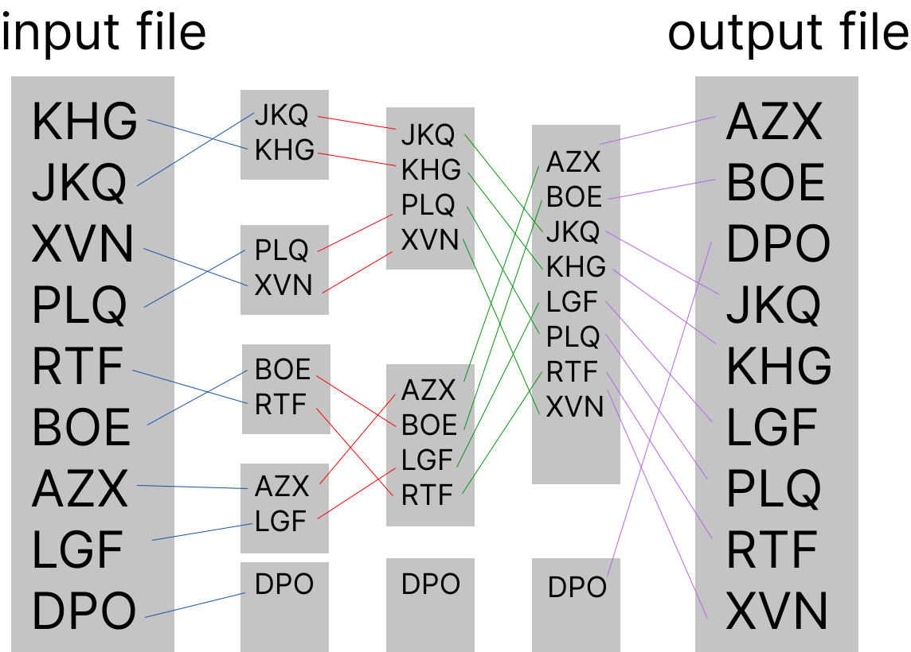

# The Big File Sorting Challenge 🗄️

 

## About 📖

 

*My implementation of the [external merge sort](https://en.wikipedia.org/wiki/External_sorting) algorithm with typescript/node. It solves the problem of handling large size unsorted file while the data cannot be loaded on the volatile memory. The approach is to create chunks which are temporary files that we will sort and merge at each step of the process, thus we will get as output the same file, but sorted, having taken advantage of the hard drive.*

 

---

## How does it work ? 🔧

 

*It's a typescript class with an asynchronous method prototyped as follow :*

<code>
class SortFile {
 
<code style=margin-left:5em>constructor(   </code>
<code style=margin-left:10em>private maxFileSizeBytes: number, </code>
<code style=margin-left:10em>private numberOfLinesPerSegment: number, </code>
<code style=margin-left:10em>private lineSizeBytes: number);<br/ </code>
<code style=margin-left:5em>public async Sort(inFilename: string, outFilename: string) : Promise&lt;void&gt;; </code>
}
</code>

 

#### Let's take a look at what's going on in the background 👀

 

 

---

 

## Run the app 💻

- clone the repository and install dependencies ✔️

> git clone repo_name

> cd repo_name

> npm install

- Fill in parameters and run the program ✔️

> open src/index.ts

> Fill in const param{} and and const file{}

> Run it as follows ./script.sh or manually with 'npm start'

 

---

 

## Technologies 🧰

 

| | Language                     | Runtime | Libraries |
| :---                         | :---                         | :---    | :---      |
| | [TypeScript](https://www.typescriptlang.org/) | [Nodejs](https://nodejs.org/en/) | [fs / fsPromises](https://nodejs.org/dist/latest-v16.x/docs/api/fs.html) |
| Notes | | | Filesystem I/O

 

---

 
